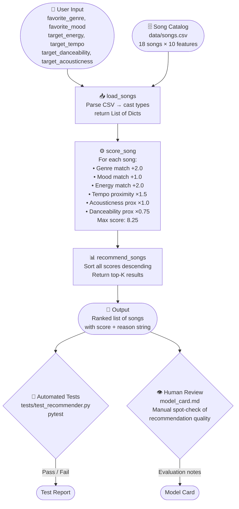

# System Diagram: BestMatchMusic Recommender

## Data Flow



## Component Descriptions

| Component | File | Role |
|---|---|---|
| User Input | `src/main.py` | Defines the taste profile dict passed into the recommender |
| Song Catalog | `data/songs.csv` | Static dataset of 18 songs with 10 numeric/categorical features |
| Loader | `src/recommender.py → load_songs()` | Reads CSV, casts strings to int/float |
| Scorer | `src/recommender.py → score_song()` | Applies weighted scoring rules to one song vs. one user profile |
| Ranker | `src/recommender.py → recommend_songs()` | Scores all songs, sorts descending, slices top-K |
| OOP Layer | `src/recommender.py → Recommender class` | Wraps scorer in an object interface used by the test suite |
| Automated Tests | `tests/test_recommender.py` | Verifies ranking order and explanation output with pytest |
| Human Review | `model_card.md` | Documents bias, limitations, and evaluation by the developer |

## Where Humans Are Involved

```
Input design  ──→  Human writes UserProfile (taste preferences)
                   Human curates songs.csv catalog

Output review ──→  Human reads model_card.md evaluation
                   Human spot-checks whether top results "feel right"
                   Human adjusts point weights based on intuition
```
